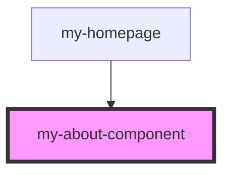

# my-about-component

<!-- Auto Generated Below -->

## Properties

| Property      | Attribute     | Description | Type      | Default     |
| ------------- | ------------- | ----------- | --------- | ----------- |
| `responsible` | `responsible` |             | `boolean` | `undefined` |

## Dependencies

### Used by

 - [my-homepage](../my-homepage)

### Graph

----------------------------------------------

*Built with [StencilJS](https://stenciljs.com/)*
