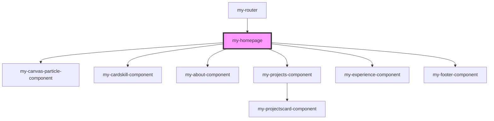

# my-component

<!-- Auto Generated Below -->

## Dependencies

### Used by

 - [my-router](../my-router)

### Depends on

- [my-canvas-particle-component](../my-canvas-particle-component)
- [my-cardskill-component](../my-cardskill-component)
- [my-about-component](../my-about-component)
- [my-projects-component](../my-projects-component)
- [my-experience-component](../my-experience-component)
- [my-footer-component](../my-footer-component)

### Graph

----------------------------------------------

*Built with [StencilJS](https://stenciljs.com/)*
