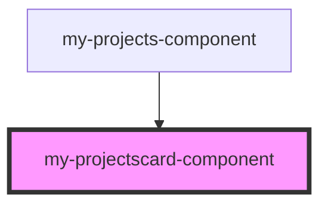

# my-projectscard-component

<!-- Auto Generated Below -->

## Properties

| Property     | Attribute     | Description | Type                                                                                                                                         | Default     |
| ------------ | ------------- | ----------- | -------------------------------------------------------------------------------------------------------------------------------------------- | ----------- |
| `projectObj` | `project-obj` |             | `{ title: string; date: string; description: string; sinopse: string; imagesSlider: string[]; tecnologias: string; funccionality: string; }` | `undefined` |

## Dependencies

### Used by

 - [my-projects-component](.)

### Graph

----------------------------------------------

*Built with [StencilJS](https://stenciljs.com/)*
